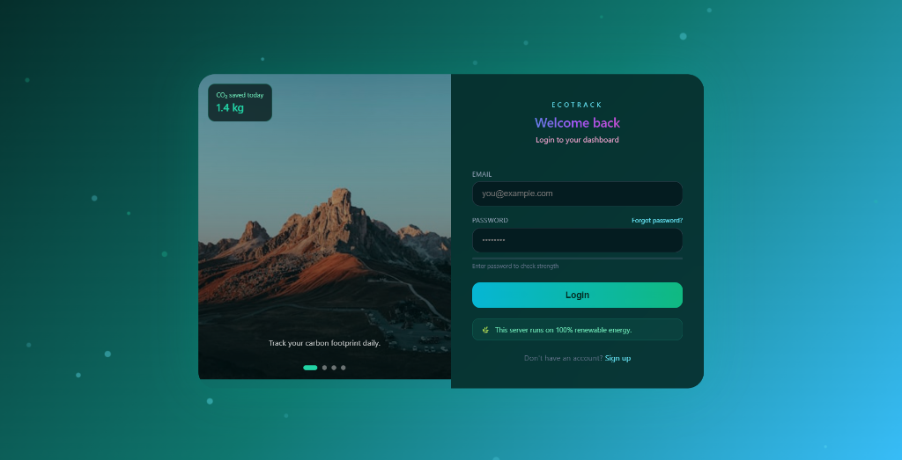
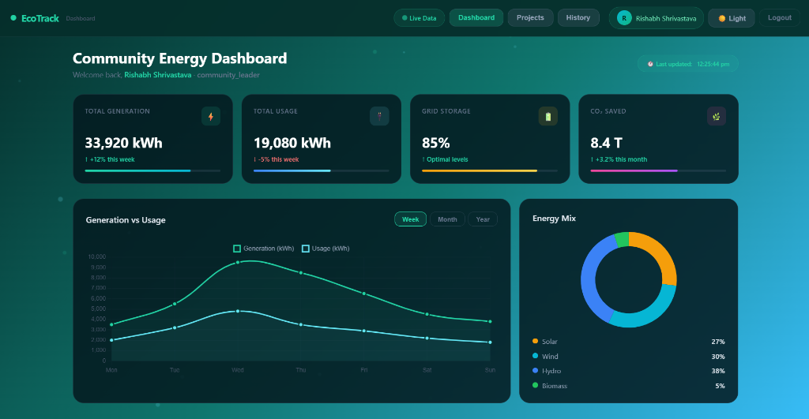
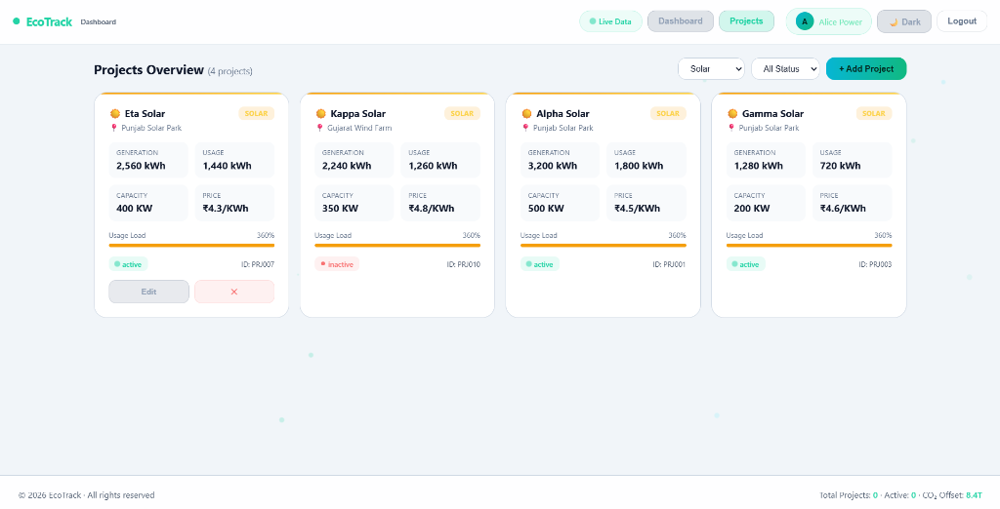
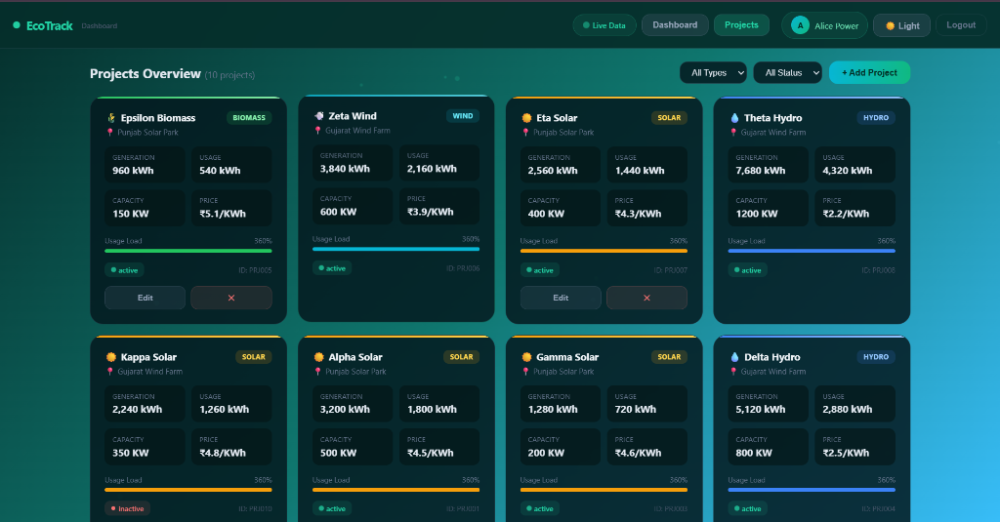

# 🌍 Renewable Energy Resource Tracker for Communities

**Empowering communities to track, manage, and optimize renewable energy resources.**

The Renewable Energy Resource Tracker is a robust platform designed for communities, energy providers, and local leaders. It provides a centralized, interactive dashboard to monitor renewable energy projects, track real-time generation and usage, and drive sustainable initiatives—all in one place.

---

## ✨ Features

### 🔐 **Secure Access & Validation**
- **Role-Based Access**: Energy providers and community leaders register and validate participation via a unique ID system.
- **Eco-Friendly Login**: A clean, modern authentication interface that tracks your daily carbon footprint savings right from the start.

### 📊 **Community Energy Dashboard**
- **Real-Time Analytics**: Monitor Total Generation, Total Usage, Grid Storage levels, and overall CO₂ saved.
- **Interactive Visualizations**: View Generation vs. Usage trends through dynamic line charts and understand the community's Energy Mix (Solar, Wind, Hydro, Biomass) with intuitive donut charts.

### ⚡ **Project Tracking & Management**
- **Manage Projects**: Easily view, add, edit, and monitor the status of various renewable energy projects across the community.
- **Advanced Filtering**: Filter energy projects based on the type of energy (Solar, Wind, Hydro, Biomass), location, and operational status (Active/Inactive).
- **Project Details**: Get instant insights into capacity (KW), pricing (₹/KWh), and current generation metrics for each specific project.

### 🌓 **Modern & Responsive UI**
- **Dark/Light Mode**: Seamlessly switch between light and dark themes to suit your viewing preference.
- **Accessible Design**: Built with a responsive, premium interface that looks beautiful on any device.

---

## 🚀 Live Demo

**Experience the platform live:**
🔗 **[Renewable Energy Resource Tracker](https://renewable-energy-resource-tracker.onrender.com/)**

---

## 📸 Screenshots

<p align="center">
  
  
</p>
<p align="center">
  
  
</p>

---

## 🛠 Tech Stack

- **Frontend**: HTML5, CSS3, JavaScript (Chart.js for visualizations)
- **Backend**: Node.js, Express.js
- **Database**: MongoDB (Atlas) for secure data storage of users, projects, and transactions
- **Deployment**: Render

---

## 📦 Local Installation

To run this project locally on your machine:

1. **Clone the repository** (or download the source code).
2. **Install dependencies**:
   ```bash
   npm install
   ```
3. **Set up environment variables**:
   Create a `.env` file in the root directory and add your MongoDB connection string:
   ```env
   MONGO_URI=your_mongodb_connection_string
   PORT=3000
   ```
4. **Seed the database** (Optional, for initial data):
   ```bash
   node seed.js
   ```
5. **Start the server**:
   ```bash
   node server.js
   ```
6. **Open your browser** and navigate to `http://localhost:3000`.

---

## 🔒 Privacy & Security
The platform uses robust authentication and validation. User credentials and community project data are securely stored and managed using MongoDB Atlas. Role-based unique IDs ensure that only authorized community leaders and providers can modify project states.

---

**Developed for a greener, sustainable future. 🌱**
